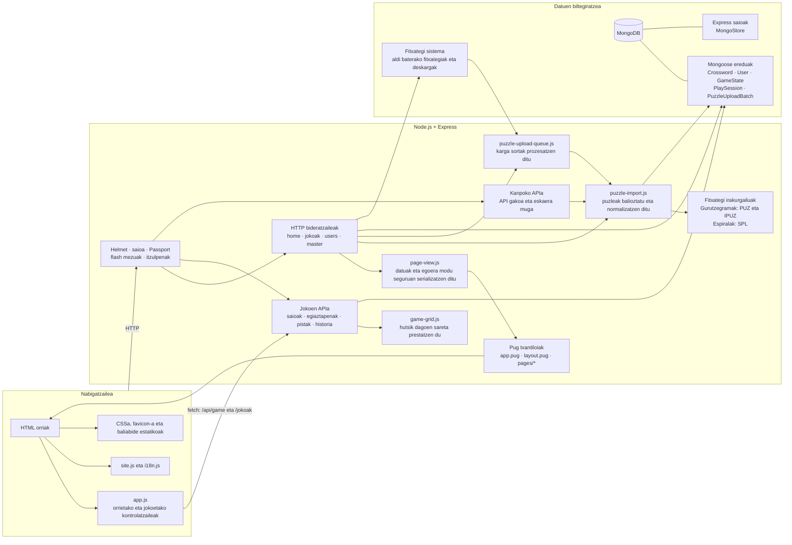

# Xederaren arkitektura

Aplikazioaren egungo egitura: Express zerbitzaria, Pug txantiloiak eta nabigatzaileko JavaScript natiboa.

## Orrien ibilbidea

- Hasierako orria (`/`) `home.pug` txantiloiarekin errendatzen da; txantiloi horrek `layout.pug` erabiltzen du oinarri.
- Gainerako orriak `page-view.js` eta `app.pug` bidez errendatzen dira. `app.pug`-ek `views/pages/` karpetako orri egokia eta goiburua eta orri-oina txertatzen ditu.
- `app.js`-ek orriaren HTMLko atributuen arabera abiarazten ditu kontrolatzaileak. `site.js`-ek nabigazio partekatua kudeatzen du; `i18n.js`-ek, berriz, itzulpenak.

## Jokoen eta puzleen ibilbidea

- `GET /jokoak/game/:id` eskaerak puzlea kargatzen du. PUZ eta IPUZ gurutzegramak `Crossword` egitura partekatuan normalizatzen dira; SPL jokoak `SpiralPuzzle` irakurgailuak kargatzen ditu. Zerbitzariak jolasteko behar diren datuak soilik bidaltzen ditu, erantzunak bezeroari erakutsi gabe.
- Joko-ekintzek `/api/game` APIra jotzen dute. Uneko jokoaren egoera Express saioan gordetzen da; erabiltzaile-kontu bati lotutako aurrerapena `GameState` eta `PlaySession` ereduetan gordetzen da.
- Puzle-kargak `jokoak` bideratzaileetatik igarotzen dira, eta `puzzle-upload-queue.js`-k eta `importPuzzle()` funtzioak prozesatzen dituzte. Emaitza `Crossword` dokumentu gisa gordetzen da; sorta eta haren egoera `PuzzleUploadBatch` ereduan erregistratzen dira.
- `/external` APIak puzleak zerrendatu, inportatu eta ezabatzeko aukera ematen du. API gako bidez babestuta dago eta eskaera kopuruaren muga du.
